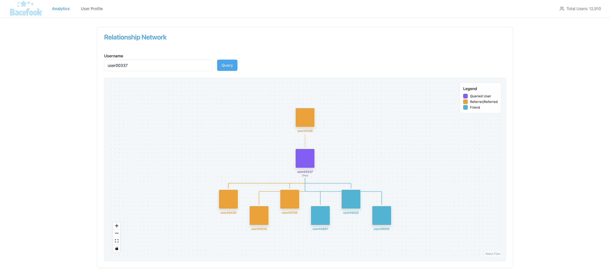

# Bacefook Backend Assignment

This repository contains the solution for the Zentry backend assignment. It uses Bun as the main JavaScript runtime. Please install Bun to run this project.

Performance was measured on a 2021 MacBook Pro (M1 Pro, 16GB RAM, 512GB SSD) running macOS 15.5 with Bun 1.2.18.

## Components

This project consists of six components:

### 1. events-producer

This component uses the provided generator to feed data into a Kafka topic with a single partition, achieving a throughput of ~70-100k messages per second with `count = 5` as the input for the events generator.

### 2. backend-processor

This component reads events from the Kafka topic, processes them to construct a relationship graph, and updates MongoDB with the most recent state of the graph in every batch. It also stores all observed events in MongoDB, which allows other sub-services to replay and process the data for analytics.

The relationship graph is designed to be idempotent; duplicate events will not corrupt the state of the graph, provided that the events are ordered (hence the single partition in the Kafka topic). The processor achieves a throughput of around 40k messages per second (~200k messages per 5 seconds).

### 3. backend-api

This component serves the following API endpoints (default port: `3000`):

- `GET /analytics/network`
- `GET /analytics/leaderboard`
- `GET /users/{name}/top-friends`
- `GET /users/{name}/friends`
- `GET /meta/snapshots`
- `GET /meta/users`

> Note: `GET /meta/snapshots` and `GET /meta/users` are provided for metadata purposes and are **not** part of the assignment requirements.

On startup, this service also acts as a replayer for processing events stored in MongoDB for analytical purposes. It retrieves all events from MongoDB in batches of 100,000 records and saves them to disk to prevent memory exhaustion. It then uses these on-disk event chunks to feed the relationship graph and generate snapshot files for every 5 seconds of the records' creation times.

This process is intended to always be up-to-date with MongoDB's state. However, due to time constraints, it currently only syncs with the database on startup.

From observation, it appears that this service is capable of retrieving and ingesting around 100k records per second.

This component does not yet serve:

- User's referral timeseries graph for any given time range.
- User's referral count for any given time range.
- User's friends count timeseries graph for any given time range.
- User's friends count for any given time range.

The author believes that these four features can be implemented together if attempted.

### 4. frontend

This frontend features a total user count on its header and two pages: analytics and user profile.

On the analytics page, you can query by username for a relationship graph showing the friends of the queried user, the users they have referred, and the user that referred the queried user. On this page, you can also query leaderboards of network strength and referral points gained by time range.

On the user profile page, you can query by username to retrieve their top 3 influential friends and their friends, along with those users' friend counts, referral counts, and referral points.

Due to time constraints, the time series requirements on the user profile page have not been implemented.

#### 5. Redpanda Broker

Used as the Kafka broker, it is fed with events generated by the events generator for playback ability and uses one partition to guarantee global order.

#### 6. MongoDB

Stores the most recent state of the relationship graph and all events retrieved from the Kafka broker, which can then be used for playback to process data for analytical purposes.

## Architecture

The system is composed of the following high-level data flow:

### Summary

1.  **Event Generation**  
    The `events-producer` feeds synthetic user events (register, referral, addfriend, unfriend) into a single-partition Kafka topic.
2.  **Processing & Storage**  
    The `backend-processor` consumes these events in order, builds a relationship graph in memory, updates MongoDB with user states, and stores the raw events for later replay.
3.  **Analytics Replay**  
    The `backend-api` service replays stored events from MongoDB into a graph on startup, creates 5-second interval snapshots, and exposes both analytical endpoints and the most recent state of users.
4.  **Frontend Visualization**  
    The `frontend` visualizes the data from `backend-api`, including network graphs, leaderboards, and user metrics.

## How to Run

A Docker Compose file is included in this directory. Run `docker-compose up -d` to create the following services:

- **Redpanda**: A Kafka broker on port `19092`.
- **Redpanda Console**: A web UI for Redpanda at `http://localhost:8080`. The `bacefook-relationship-events-topic` is automatically created on startup.
- **MongoDB**: An instance is created and available at port `27017`.

Please see the README in each component's folder to continue the startup process for each component.

## What Has Been Accomplished

- Kafka data pipeline for global event ordering and the ability to replay in case of a crash or failure to sync with the database.
- The processor can process events, satisfying the required throughput.
- Display a network of relationships for a given user.
- Display a `network strength` ranking in a leaderboard-like list for any time range.
- Display a `referral points` ranking in a leaderboard-like list for any time range.
- Display a user's top 3 `influential friends`.
- Display a paginated list of a user's friends.

## What Hasn't Been Accomplished

- User's referral timeseries graph for any given time range.
- User's referral count for any given time range.
- User's friends count timeseries graph for any given time range.
- User's friends count for any given time range.
- The backend API only syncs with the database on startup and is not always up-to-date for the analytics page.

## Reflection

### Events Producer and Replay Design

The events-producer component, whose responsibility is to feed the Kafka broker with events, in the author's opinion, may be unnecessary for this assignment, and plugging the events generator object into the processor directly may have been a better idea. By doing that, more time would have been available for the author to complete more features and make the main components more complete. Though even right now, the author must say that even if it's a mock assignment, it feels architecturally incorrect to do so, and the state will start from zero every time the processor runs since the events generator doesn't persist its memory onto disk. Apart from that, the author felt that the processor deserved that replay ability that comes with using the Kafka broker in the case of crashing or failure to update the database.

### Kafka Partitioning and Throughput

The choice of using a Kafka topic with 1 partition limits scalability greatly. However, in its current form, using a Redpanda image, its performance is about four times greater than the required throughput, so it's acceptable in the author's opinion and could be improved further if deployed on a dedicated machine rather than in a Docker container.

### Database Choice: MongoDB

The choice of using MongoDB comes from its NoSQL nature, which allows for easier horizontal scaling compared to SQL databases, and its user-friendly interface, making it a great choice given the potential need for scalability and the limited time available. While there may be other databases with better performance, MongoDB felt like the all-in-one solution the author needed.

### Replayer Placement and Accuracy

While the replayer is currently implemented in the backend-api component, it could have been implemented within the processor itself, especially given that the processor currently performs at around twice the required throughput. However, this would introduce the risk of losing state in case the processor fails to update the database during snapshot generation. If that happens, the snapshot of that moment could be lost permanently. To avoid this, the author chose the replay-based approach to guarantee absolute accuracy.

### Time Series vs. Snapshots

The time series features have not been implemented in this repository and were given lower priority than the snapshot feature used for powering leaderboards. This decision was made because the author believed that collecting the necessary data points for time series features was more complex and could not be completed safely within the given time. However, since the processor still has some performance leeway, it is entirely possible to generate time series data points during event ingestion in the processor and store them in a dedicated time series database for future queries. Alternatively, these data points could be generated by the replayer alongside snapshots. One concern was the potential volume of these data points, which in the author's opinion may require storing historical data for all users in the system. Because of this concern, the author prioritized snapshot generation, which is critical for the leaderboards, over time series data.

### Replayer Architecture and Storage Strategy

The replayer is currently embedded within the same component as the API server, which is not ideal. It should be a standalone service, but due to time constraint, the options were limited. The replayer only syncs with the database during startup, but it was originally intended to remain in sync continuously. It also caches events read from the database onto disk for faster startup, which is unnecessary and could be replaced by persisting a timestamp or checkpoint in the database. Snapshot files are being saved onto disk, but this could be improved by saving them to a remote storage service. However, if the relationship graph state grows significantly and snapshot files become very large, uploading them may no longer be feasible, making the on-disk approach more suitable in such cases.

### Final Thoughts and Code Quality

The author is not quite satisfied with the outcome, as some requirements were not met and many parts of the code remain unpolished. The use of the any type still exists, only a small portion of the code is covered by tests, and there is bad code structure and folder structure. That said, considering everything was built within roughly 2 man-days, it doesn’t seem that unacceptable in the author’s opinion.

---

Thank you for taking the time to read this and for the opportunity. I learned a lot through this assignment!
